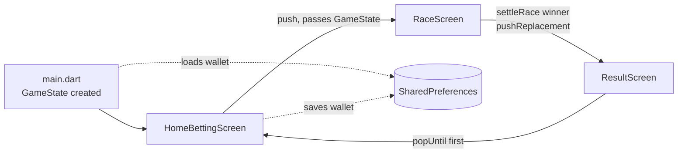

# System Architecture

## Overview

Single-package Flutter app, 3 screens, plain `setState` state management (lab
constraint). One mutable `GameState` instance lives at the app root and is passed
**by reference** down the navigation stack, so the wallet survives the
Home → Race → Result → Home loop without any global store.

## Navigation & data flow



- **Home → Race:** `Navigator.push(RaceScreen(game))`, then `setState` on return.
- **Race → Result:** when a horse reaches the finish line, the timer is cancelled,
  `game.settleRace(winner)` is called **exactly once** (guarded by `_finished`),
  and the immutable `RaceOutcome` is handed to `ResultScreen` via `pushReplacement`.
- **Result → Home:** both buttons `popUntil((r) => r.isFirst)`.

## Layers

| Layer | Files | Responsibility |
|-------|-------|----------------|
| Entry | `main.dart` | Load wallet, create `GameState`, theme, host Home |
| Models | `models/` | `Racer`, `GameState` (+ `RaceOutcome`) — data + betting rules |
| Screens | `screens/` | The 3 stateful screens |
| Widgets | `widgets/` | Reusable presentational pieces |
| Services | `services/` | `WalletStorage` (prefs), `SoundService` (audio) — bonus, fail-soft |
| Theme/Utils | `theme/`, `utils/` | Palette, roster, tuning constants |

## Betting / payout logic (single source of truth)

`GameState.settleRace(winner)`:

```
money = money - totalBet + (stakeOnWinner × winMultiplier)   // winMultiplier = 3
```

Every stake leaves the wallet; the stake on the winner returns at 3×. Returns a
`RaceOutcome` (winner, bets snapshot, totalStaked, payout, netChange, moneyAfter)
and clears bets. Covered by unit tests in `test/game_state_test.dart`.

## Race animation ("fake slider")

`RaceScreen` keeps `List<double> _progress` (0..1) per racer. A
`Timer.periodic(RaceConfig.tick)` advances each by a random step in
`[minStep, maxStep]`. `AnimatedPositioned` (duration = tick) inside a `Stack`
glides the horse glyph across a `LayoutBuilder`-measured lane; progress `1.0`
lands on the finish line. Winner = highest progress, tie-break by lowest id.
The `Slider` widget is intentionally unused, per the lab requirement.

## Failure isolation

Bonus services never break gameplay: `WalletStorage` and `SoundService` swallow
all errors (e.g. browser audio-autoplay blocks, unavailable storage).
